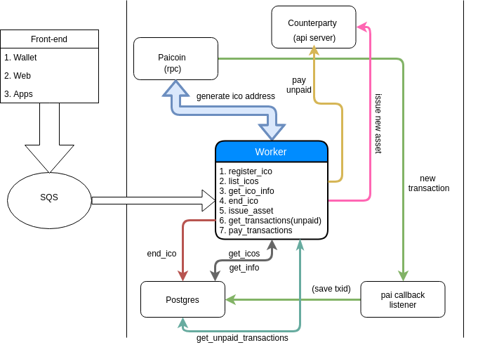

# Smartnode

## Structure

* Paicoin node
* Counterparty node (API server and client)
* Worker
* Database (postgres)

**Scheme (draft)**

## Worker

Uses DevSmartNodeSQS queue

**Methods (to be updated)**

<strong>Register ICO</strong>

 

Saves primary ICO inforamtion

<strong>Example SQS message</strong>

<pre>
{
    "redisData": {
      "redisChannel": "id"
    },
    "input": {
      "method": "register_ico",
      "params": {
        "ico_name": "My coolest ICO",
        "start_date": "start_date",
        "end_date": "end_date",
        "asset": "BTC",
        "quantity": 10000000,
        "description": "description of new asset"
      }
    }
}
</pre>

<strong>Output</strong>

<pre>
{
  "SmartWorker": {
    "status": {
      "status": "SUCCESS",
      "progress": 100,
      "message": "Finished worker"
    },
    "output": {
      "response": "unique_ico_address"
    },
    "worker_data": {
      "workerIpAddress": "172.31.27.70",
      "workerEnvironment": "Environment"
    }
  }
}
</pre>

<strong>Get ICO info</strong>

 

Get information about ICO

<strong>Example SQS message</strong>

<pre>
{
    "redisData": {
      "redisChannel": "id"
    },
    "input": {
      "method": "get_ico_info",
      "params": {
        "source": "pai_address_associated_with_ico"
      }
    }
}
</pre>

<strong>Output</strong>

<pre>
{
  "SmartWorker": {
    "status": {
      "status": "SUCCESS",
      "progress": 100,
      "message": "Finished worker"
    },
    "output": {
      "response": "ico_info"
    },
    "worker_data": {
      "workerIpAddress": "172.31.27.70",
      "workerEnvironment": "Environment"
    }
  }
}
</pre>

<strong>List of all ICO</strong>

 

Get information about all ICO

<strong>Example SQS message</strong>

<pre>
{
    "redisData": {
      "redisChannel": "id"
    },
    "input": {
      "method": "list_ico",
      "params": {
        (?)
      }
    }
}
</pre>

<strong>Output</strong>

<pre>
{
  "SmartWorker": {
    "status": {
      "status": "SUCCESS",
      "progress": 100,
      "message": "Finished worker"
    },
    "output": {
      "response": ["ico_list"]
    },
    "worker_data": {
      "workerIpAddress": "172.31.27.70",
      "workerEnvironment": "Environment"
    }
  }
}
</pre>

<strong>Issue new asset</strong>

 

Create new asset

<strong>Example SQS message</strong>

<pre>
{
    "redisData": {
      "redisChannel": "id"
    },
    "input": {
      "method": "issuance",
      "params": {
        "source": "address",
        "quantity": 10000000,
        "asset": "BTC",
        "divisible": "True",
        "description": "description of new asset",
        "fee": 10000
      }
    }
}
</pre>

<strong>Output</strong>

<pre>
{
  "SmartWorker": {
    "status": {
      "status": "SUCCESS",
      "progress": 100,
      "message": "Finished worker"
    },
    "output": {
      "response": "unigned_tx_hex"
    },
    "worker_data": {
      "workerIpAddress": "172.31.27.70",
      "workerEnvironment": "Environment"
    }
  }
}
</pre>

<strong>Get unpaid transactions</strong>

 

Returns list of all unpaid transactions

<strong>Example SQS message</strong>

<pre>
{
    "redisData": {
      "redisChannel": "id"
    },
    "input": {
      "method": "get_unpaid_transactions",
      "params": {
        "ico": "ico_name",
        "params": [params]
      }
    }
}
</pre>

<strong>Output</strong>

<pre>
{
  "SmartWorker": {
    "status": {
      "status": "SUCCESS",
      "progress": 100,
      "message": "Finished worker"
    },
    "output": {
      "response": ["transactions_list"]
    },
    "worker_data": {
      "workerIpAddress": "172.31.27.70",
      "workerEnvironment": "Environment"
    }
  }
}
</pre>

<strong>Pay unpaid transactions</strong>

 

Send required amount of asset to contributor

<strong>Example SQS message</strong>

<pre>
{
    "redisData": {
      "redisChannel": "id"
    },
    "input": {
      "method": "pay_unpaid_transactions",
      "params": {
        [transactions_list]
      }
    }
}
</pre>

<strong>Output</strong>

<pre>
{
  "SmartWorker": {
    "status": {
      "status": "SUCCESS",
      "progress": 100,
      "message": "Finished worker"
    },
    "output": {
      "response": ["txid_list"]
    },
    "worker_data": {
      "workerIpAddress": "172.31.27.70",
      "workerEnvironment": "Environment"
    }
  }
}
</pre>

